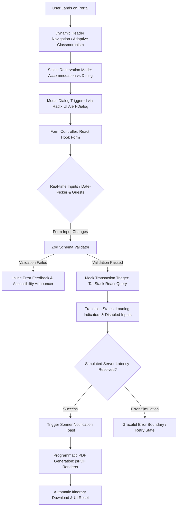

<div align="center">
  <h1>Vertex — Next-Generation Resort Interface</h1>
  <p><strong>A high-performance frontend experience where design, motion, and usability work together.</strong></p>
  <p align="center">
  
  
  
  
</p>
</div>

---

## Overview

Modern luxury web interfaces often prioritize visual aesthetics at the expense of core performance metrics. Heavy assets, unchecked rendering cycles, and unoptimized animation frames can lead to high Interaction to Next Paint (INP) rates, creating friction during crucial workflows like reservation bookings.

**Vertex** was designed to solve this performance-fidelity gap. It is a client-first application that balances rich, storytelling micro-interactions with precise layout performance, offering a smooth user experience across varying device viewports.

---

## Why Vertex Exists

Many modern, animation-heavy interfaces face structural limitations:
* Interfaces look premium but suffer from frame rate drops under complex scroll animations.
* Interactive components exist as disconnected elements, causing inconsistent focus management.
* Dynamic client states (such as multifaceted calendars) lack resilient client-side form validation.
* Codebases scale poorly due to the tight coupling of UI templates and business logic.

**Vertex addresses these challenges directly:**
* **Purposeful Motion**: Every animation operates under hardware-accelerated transforms to avoid browser repaint storms.
* **Component Accessibility**: Leveraging headless primitives to enforce keyboard navigability and correct ARIA states out of the box.
* **Separated Architecture**: Business state, custom validation schemas, and presenter layouts are cleanly modularized.

---

## Core Client Experiences

### 1. Dynamic Booking & Validation Engine
The interface houses a modular booking wizard that dynamically handles both **Room Reservations** and **Dining Bookings** within a single validation footprint.
* Implements dynamic forms managed by **React Hook Form**, leveraging **Zod** schema validations for immediate feedback on date range selections, capacity limits, and chronological constraints.
* Simulates server latency using **TanStack React Query** mutations to manage global loading, error boundaries, and transition states.
* Integrates **jsPDF** programmatically to parse successful client session records and generate localized booking invoices directly in-browser.

### 2. High-Frame-Rate Storytelling
Instead of relying on heavy third-party animation engines, Vertex leverages lightweight native structures to create an immersive, narrative layout.
* Uses the browser’s **Intersection Observer API** to activate scroll-triggered transition triggers only when elements occupy the visible viewport.
* Reduces Cumulative Layout Shift (CLS) by utilizing predetermined aspect-ratio calculations alongside hardware-accelerated CSS properties (`opacity`, `transform`).

### 3. Accessible UI Primitives
Interactive elements are constructed to feel responsive and natural, avoiding excessive DOM node inflation.
* **Navigation Overlay**: An adaptive glassmorphic navbar that adjusts transparency and blur indexes dynamically based on window scroll parameters.
* **Carousel Explorers**: Drag-to-slide carousels powered by **Embla Carousel** for natural tactile feedback on mobile devices.
* **Adaptive Contexts**: Interactive, responsive panels built using specialized drawer primitives (**Vaul**) and flexible layout splitters (**React Resizable Panels**).

---

## Booking State & Client Resolution Flow

This architectural flowchart illustrates how the client-side system resolves interactive user inputs, manages component states, validates data schemas, and resolves asynchronous PDF tasks locally:



---

## Architecture & Codebase Design

Vertex follows a modular, feature-first structure designed to keep developers highly isolated when adding new layout components:

```bash
src/
├── components/
│   ├── ui/           # Reusable design system tokens & primitives (shadcn/radix)
│   ├── features/     # Isolated operational features (Booking controllers, modal workflows)
│   └── sections/     # Page-level structures (Hero presentation, storytelling viewports)
├── pages/            # Route components resolved via React Router DOM
├── hooks/            # Shared logic helpers (Intersection Observer, viewport calculations)
├── lib/              # Client utility functions (Tailwind Merge, date formatters)
└── assets/           # Optimized structural graphics & typography
```

---

## Tech Stack

* **Frontend Library**: React 18 (utilizing strict state isolation and custom hooks)
* **Build System**: Vite (configured with `@vitejs/plugin-react-swc` for rapid hot-module updates)
* **Type System**: TypeScript (configured with Strict Mode checks)
* **Styling**: Tailwind CSS + shadcn/ui headless component primitives
* **Asynchronous Caching**: TanStack React Query (v5)
* **Form Resolution**: React Hook Form + Zod resolvers
* **Document Compilation**: jsPDF (integrated for direct PDF document download)
* **Routing**: React Router DOM (v6)
* **UI Utilities**: Lucide Icons, Embla Carousel, Tailwind Animate

---

## Future Scope

While Vertex currently operates as an optimized client-first architecture, the system is prepared for backend integration:
* **API Integration**: Developing a microservice REST API (Node.js/Express) to handle real-time reservation processing.
* **Database Pipeline**: Connecting PostgreSQL database tables using Prisma ORM to secure persistent pricing, room counts, and dining availability.
* **Authentication**: Integrating secure multi-factor authentication (MFA) and customizable user profile dashboards.
* **Admin Workspace**: Adding statistical dashboard panels driven by **Recharts** to monitor simulation metrics, sales ratios, and room occupancy graphs in real-time.

---

## Getting Started

### 1. Prerequisites
Ensure you have **Node.js 18+** and **NPM** (or your preferred package manager) configured on your machine.

### 2. Clone the Repository
```bash
git clone https://github.com/abdul-rahman-0x/vertex-luxury-resort.git
cd vertex-luxury-resort
```

### 3. Install Dependencies
```bash
npm install
```

### 4. Boot up Development Server
```bash
npm run dev
```
Open `http://localhost:5173` in your web browser to view the application.

---

## License

This project is licensed under the [MIT License](LICENSE).

---

## Author

Developed by **[Abdul Rahman](https://github.com/abdul-rahman-0x)**

